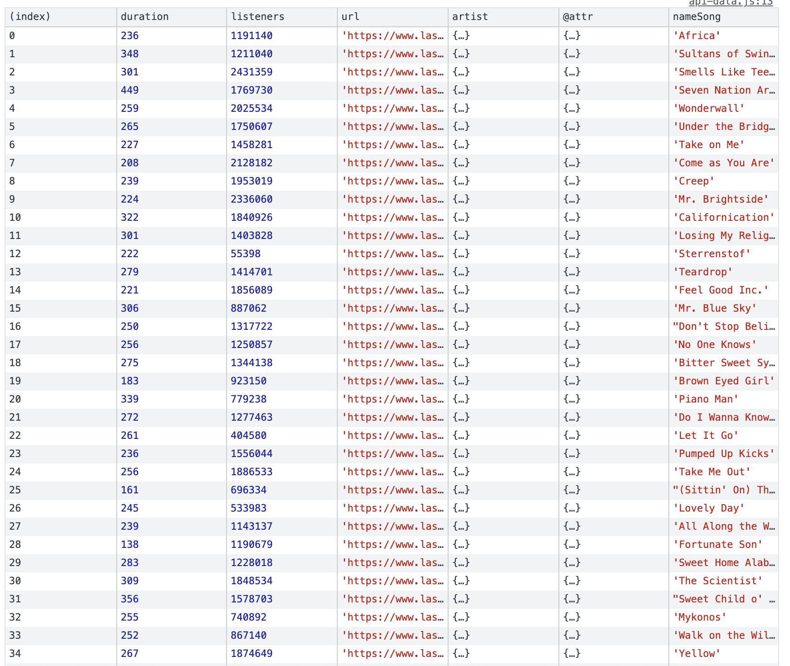

# :desktop_computer: Functional programming

## :bookmark_tabs:	 Table of Contents

* [Concept](https://github.com/lottekoblens/functionalprogramming#concept)
* [Proces](https://github.com/lottekoblens/functionalprogramming#proces)
* [Installation](https://github.com/lottekoblens/functionalprogramming#installation)
* [Wishlist](https://github.com/lottekoblens/functionalprogramming#wishlist)
* [Assignment](https://github.com/lottekoblens/functionalprogramming#assignment)
  * [Rubric](https://github.com/lottekoblens/functionalprogramming#rubric)
* [Resources](https://github.com/lottekoblens/functionalprogramming#resources)
* [License](https://github.com/lottekoblens/functionalprogramming#license)

## :bulb: Concept



Actually, at first I didn't have a specific concept for this subject. Most importantly, I was going to clean up the data from the survey, which we filled in at the beginning of the course, using functional programming. After that we had to clean the data from an API. This is when I start thinking about a concept. I want to compare the duration of a song to the amount of listeners of a song. So I want to make a visualisation in which I displayed that.

## :chart_with_upwards_trend: Proces

If you want to know more about my proces. You can read my [Wiki](https://github.com/lottekoblens/functionalprogramming/wiki)!

## :wrench: Installation

If you want to use this code you have to clone the repository by putting this in your terminal: 
``` git clone https://github.com/lottekoblens/functionalprogramming ```

## :pencil: Wishlist

* Using different branches
* Usign modules to split up my functions and make my code better

## :clipboard: Assignment

Learn how to load and clean data through functional programming.

### :page_facing_up: Rubric


## :mag_right: Resources

* Recio, S. (2019, 21 augustus). Functional Programming in JavaScript: How and Why - Bits and Pieces. Medium. Geraadpleegd op 28 oktober 2021, van https://blog.bitsrc.io/functional-programming-in-javascript-how-and-why-94e7a97343b
* JSConf. (2016, 14 juni). Learning Functional Programming with JavaScript - Anjana Vakil - JSUnconf [Video]. YouTube. https://www.youtube.com/watch?v=e-5obm1G_FY
* MDN Web Docs. (2021, 13 september). Array.prototype.map() - JavaScript | MDN. Geraadpleegd op 2 november 2021, van https://developer.mozilla.org/en-US/docs/Web/JavaScript/Reference/Global_Objects/Array/map?retiredLocale=nl
* W3Schools. (z.d.). JavaScript Array map() Method. Geraadpleegd op 2 november 2021, van https://www.w3schools.com/jsref/jsref_map.asp
* W3 cub Docs. (z.d.). Object.defineProperty - JavaScript - W3cubDocs. Geraadpleegd op 2 november 2021, van https://docs.w3cub.com/javascript/global_objects/object/defineproperty
* MDN. (2021, 28 maart). Hoisting - Woordenlijst | MDN. Geraadpleegd op 02 november 2021, van https://developer.mozilla.org/nl/docs/Glossary/Hoisting
* w3schools. (z.d.). JavaScript Hoisting. Geraadpleegd op 02 november 2021, van https://www.w3schools.com/js/js_hoisting.asp

## :page_with_curl: License

Author: Lotte Koblens, license by [MIT](https://github.com/lottekoblens/functionalprogramming/blob/master/LICENSE)
