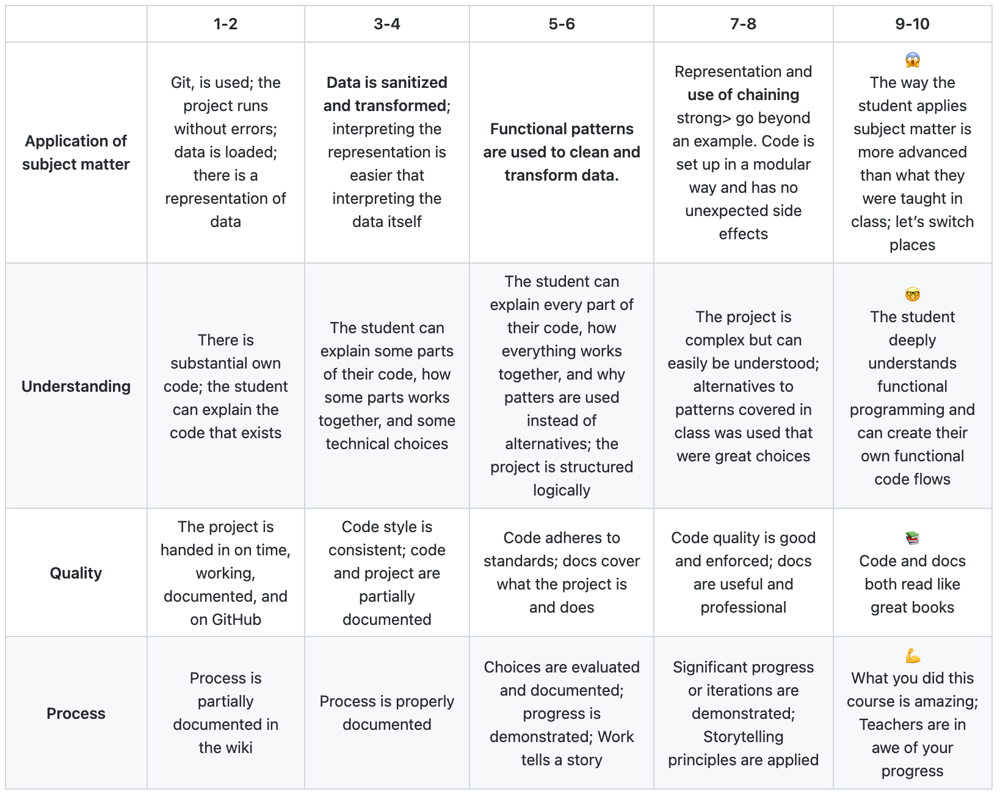

# Functional programming

## Table of Contents

* [Assessment](https://github.com/lottekoblens/functionalprogramming#assessment)
* [Data Cleaning](https://github.com/lottekoblens/functionalprogramming#data-cleaning)
  * [Concept](https://github.com/lottekoblens/functionalprogramming#concept)
* [Installation](https://github.com/lottekoblens/functionalprogramming#installation)
* [Assignment](https://github.com/lottekoblens/functionalprogramming#assignment)
  * [Rubric](https://github.com/lottekoblens/functionalprogramming#rubric)

## Assessment

Learn how to load and clean data through functional programming.

## Data cleaning

### Concept

Actually, at first I didn't have a specific concept for this subject. Most importantly, I was going to clean up the data from the survey, which we filled in at the beginning of the course, using functional programming. After that we had to clean the data from an API. This is when I start thinking about a concept. I want to compare the duration of a song to the place of the ranking. So I want to make a visualisation in which I displayed that.

## Installation

1. Clone the repository

## Assignment

### Rubric

